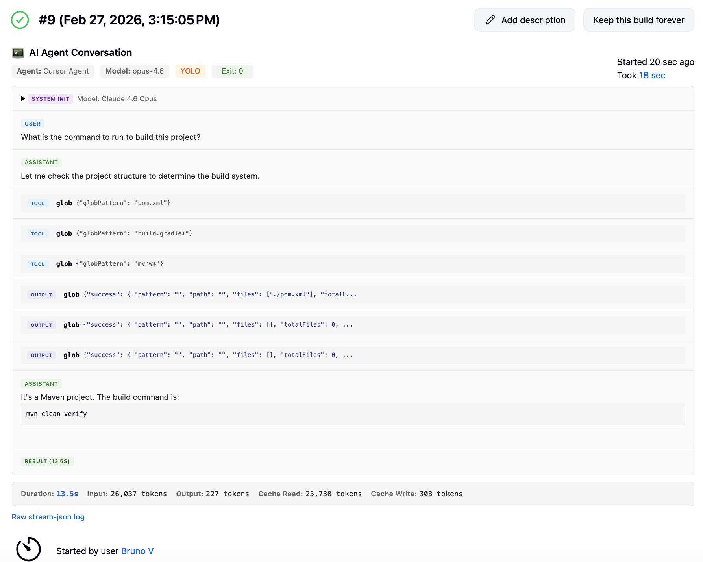

# Jenkins AI Agent Job Plugin

[](https://github.com/brunocvcunha/jenkins-ai-agent-plugin/actions/workflows/ci.yml)
[](https://opensource.org/licenses/MIT)
[](https://www.jenkins.io/)

A Jenkins plugin that adds a native **AI Agent Job** type for running autonomous coding agents
(Claude Code, Codex CLI, Cursor Agent, OpenCode, Gemini CLI) as first-class Jenkins builds.

## Features

- **Native job type** — appears in the Jenkins "New Item" dialog alongside Freestyle and Pipeline jobs.
- **Multiple agent support** — Claude Code, Codex CLI, Cursor Agent, OpenCode, and Gemini CLI.
- **Inline conversation view** — live-streaming conversation on the build page with structured display of assistant messages, tool calls with inputs/outputs, and thinking blocks.
- **Markdown rendering** — assistant and result messages are rendered as formatted HTML.
- **Approval gates** — optionally pause builds for human review before tool execution.
- **Usage statistics** — token counts, cost, and duration extracted from agent logs and displayed per build.
- **Standard Jenkins integrations** — SCM checkout, build triggers, credentials injection, post-build shell steps, and publishers.

## Supported Agents

| Agent | Output Format | Cost Tracking |
|-------|--------------|---------------|
| [Claude Code](https://docs.anthropic.com/en/docs/claude-code) | stream-json | Full (tokens + cost) |
| [Codex CLI](https://github.com/openai/codex) | JSON | Tokens only |
| [Cursor Agent](https://www.cursor.com/) | stream-json | Tokens only |
| [OpenCode](https://github.com/opencode-ai/opencode) | JSON | Full (tokens + cost) |
| [Gemini CLI](https://github.com/google-gemini/gemini-cli) | stream-json | Tokens only |

## Screenshot

Build page showing a Cursor Agent conversation with tool calls, markdown-rendered responses, and usage statistics:



## Installation

1. Build the plugin (see [Building](#building)) or download a release `.hpi`.
2. Go to **Manage Jenkins > Plugins > Advanced settings**.
3. Upload the `.hpi` file under **Deploy Plugin**.
4. Restart Jenkins.

## Quick Start

1. Click **New Item**, enter a name, and select **AI Agent Job**.
2. Configure:
   - **Agent Type** — select the coding agent to run.
   - **Prompt** — the task to send to the agent.
   - **Model** — optional model override (e.g., `claude-sonnet-4`).
   - **YOLO mode** — skip confirmation prompts in the agent.
   - **Approvals** — require human approval for tool calls.
   - **Setup script** — shell commands to run before the agent (install tools, source dotfiles, export secrets).
   - **Environment variables** — inject additional env vars (`KEY=VALUE`, one per line).
   - **Command override** — replace the default command template entirely.
   - **Extra CLI args** — append flags to the generated command.
3. Optionally add SCM, build triggers, post-build steps, and publishers as with any Jenkins job.
4. Build the job. The conversation streams live on the build page.

### Pinning a Node.js Version

Some agents (Claude Code, Gemini CLI) are installed via `npx` and require Node.js on the build agent.
To lock a specific Node.js version across builds, use the [NodeJS Plugin](https://plugins.jenkins.io/nodejs/).
Configure a NodeJS installation in **Manage Jenkins > Tools**, then select it in the job's build environment
so that `node` and `npx` resolve to the pinned version.

## Configuration Reference

### Environment Variables

The plugin injects these variables into every build:

| Variable | Description |
|----------|-------------|
| `AI_AGENT_PROMPT` | The configured prompt text |
| `AI_AGENT_MODEL` | The configured model name |
| `AI_AGENT_JOB` | The Jenkins job name |
| `AI_AGENT_BUILD_NUMBER` | The build number |

### Setup Script

The **Setup script** field accepts shell commands that run before the agent process starts.
Use it to prepare the build environment — install dependencies, source dotfiles, configure PATH,
or export secrets that the agent needs at runtime.

```bash
# Example: add local binaries to PATH, source nvm, install a CLI tool
export PATH="$HOME/.local/bin:$PATH"
source "$HOME/.nvm/nvm.sh"
nvm use 22
npm install -g @anthropic-ai/claude-code
```

The script runs via `/bin/sh -le` (login shell, exit on error) in the configured working directory
with the same environment variables as the agent. If the script exits with a non-zero code the
build fails immediately without launching the agent.

### Credential Injection

If the selected agent type has an associated credential ID (e.g., API key), the plugin resolves it from Jenkins credentials and injects it as an environment variable. The credential is masked in the build log.

### Approval Gates

When approvals are enabled and YOLO mode is off, tool calls detected in the agent's output trigger a blocking approval request. The build pauses until a user approves or denies from the build page. Denied or timed-out requests fail the build.

### Usage Statistics

After a build completes, a statistics bar shows token usage, cost (when available), and duration. Data is extracted from the agent's own reporting in the JSONL log. The level of detail depends on the agent — Claude Code and OpenCode report full cost, while others report only token counts.

## Building

Requires Java 17+ and Maven 3.9+.

```bash
mvn clean verify
```

The plugin artifact is generated at `target/jenkins-ai-agent-plugin.hpi`.

To package without running tests:

```bash
mvn clean package -DskipTests
```

## Development

```bash
# Format code (Google Java Format, AOSP style)
mvn com.spotify.fmt:fmt-maven-plugin:format

# Run with a local Jenkins instance
mvn hpi:run
```

The project uses:
- [Google Java Format](https://github.com/google/google-java-format) (AOSP variant) via `fmt-maven-plugin`
- [JaCoCo](https://www.jacoco.org/) for test coverage
- [SpotBugs](https://spotbugs.github.io/) for static analysis
- [Jenkins Test Harness](https://github.com/jenkinsci/jenkins-test-harness) for integration tests

See [CONTRIBUTING.md](CONTRIBUTING.md) for full contribution guidelines.

## Architecture

```
src/main/java/io/jenkins/plugins/aiagentjob/
├── AiAgentProject.java             # Job type (extends Project)
├── AiAgentBuild.java               # Build type binding
├── AiAgentBuilder.java             # Build step: agent execution
├── AiAgentRunAction.java           # Per-build action: conversation UI, streaming, approvals
├── AiAgentLogParser.java           # JSONL log parser for all agent formats
├── AgentUsageStats.java            # Token/cost/duration stats normalization
├── AgentType.java                  # Enum of supported agents with command templates
├── AiAgentCommandFactory.java      # Command-line construction per agent
├── ExecutionRegistry.java          # In-memory registry for live execution state
└── AiAgentCredentialInjection.java # Credential resolution and env injection
```

## License

MIT License. See [LICENSE](https://opensource.org/licenses/MIT) for details.
